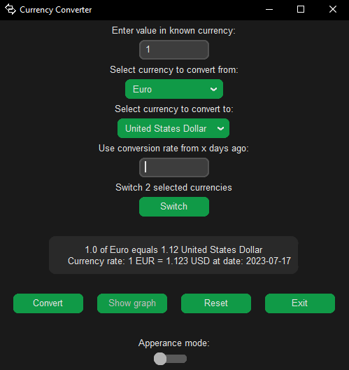

# currency-converter
  - Currency converter CV and GUI app in Python
  - Using customTkinter by Tom Schimansky: https://customtkinter.tomschimansky.com/
  - Made mid 2022

## Screenshots
 

## Features
- Get real time conversion rates for more than 20 currencies
- Get data for conversion rates in the past
- Show and visualise data on a graph up to 365 days
- white and dark mode switch

## Authors
- [@mjospovich](https://www.github.com/mjospovich)
- [@ldoric](https://github.com/ldoric)
- [@DStojanac](https://github.com/DStojanac)
